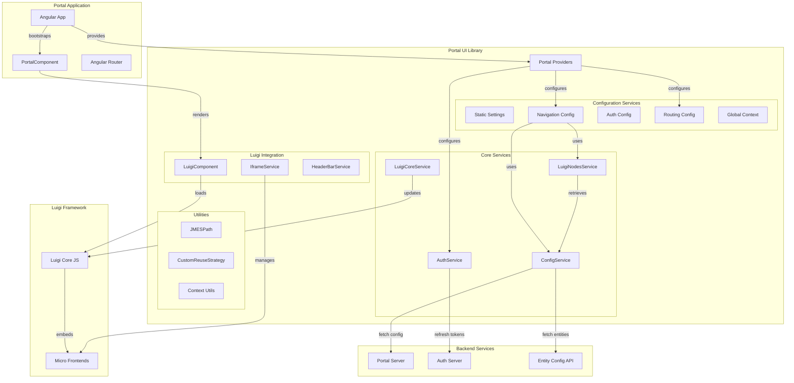
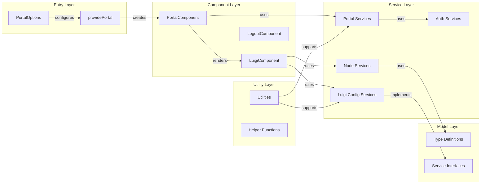
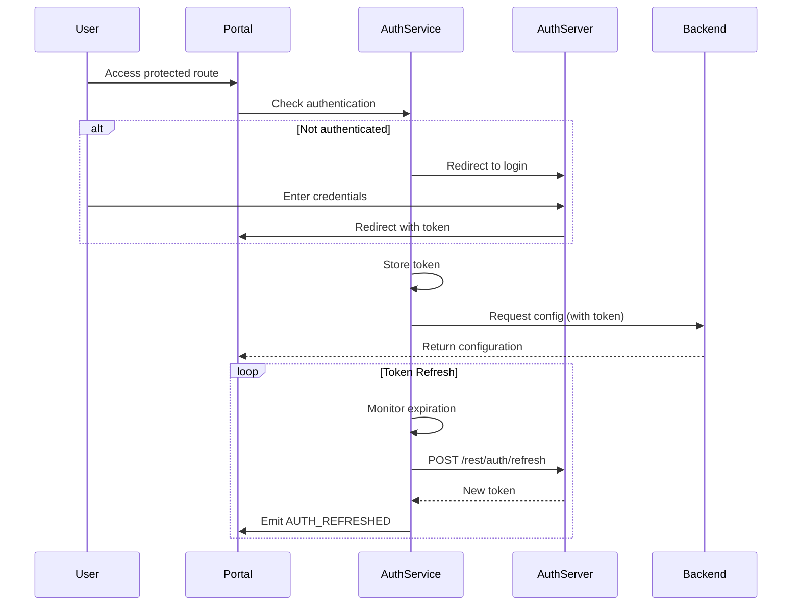

# Portal UI Library Architecture

## Overview

The Portal UI Library (`@openmfp/portal-ui-lib`) is an Angular-based library that enables applications to consume [Luigi](https://luigi-project.io/) micro frontend framework configurations dynamically. It provides the foundation for building portal server applications with authentication, dynamic navigation, and local development capabilities.

### Purpose

This library serves three primary purposes:

1. **Dynamic Luigi Configuration** - Enables runtime consumption of Luigi configuration from backend services
2. **Authentication Integration** - Provides OAuth2-based authentication with Auth Server integration
3. **Local Development Support** - Allows developers to embed locally running micro frontends into a Luigi frame for rapid development

### Key Capabilities

- Bootstrap Angular applications with Luigi micro frontend framework
- Dynamic navigation configuration retrieval from backend services
- OAuth2 authentication flow management with token refresh
- Entity-based navigation with dynamic node loading
- Feature toggle management
- Local development mode for testing micro frontends
- Web component exports for development tools
- Internationalization (i18n) support

## High-Level Architecture



## Component Architecture

### Core Components

The library is organized into several architectural layers:



### Component Responsibilities

#### Entry Points

**PortalComponent**
- Root component for the portal application
- Provides router outlet for navigation
- Sets UI5 content density class

**providePortal()**
- Main provider function for Angular dependency injection
- Configures all required services and initializers
- Accepts `PortalOptions` for customization

#### Configuration Services

**ConfigService**
- Fetches portal configuration from backend (`/rest/config`)
- Fetches entity-specific configurations (`/rest/config/:entity`)
- Implements caching for portal and entity configurations
- Handles 403 errors by redirecting to logout

**NavigationConfigService**
- Builds Luigi navigation configuration from backend data
- Processes nodes through custom processors
- Integrates global context, profile, and breadcrumbs
- Manages feature toggles

**StaticSettingsConfigService**
- Provides Luigi general settings (header, logo, favicon, etc.)
- Customizable through `PortalOptions`

**RoutingConfigService**
- Configures Luigi routing behavior
- Provides initial and post-init routing configurations
- Handles page not found scenarios

#### Node Management Services

**LuigiNodesService**
- Retrieves navigation nodes from portal configuration
- Fetches entity-specific children nodes dynamically
- Groups nodes by entity type
- Handles entity retrieval errors with custom error component

**NodesProcessingService**
- Processes and transforms Luigi nodes
- Applies custom node processing logic
- Filters nodes based on policies
- Sorts nodes by priority

**NodeUtilsService**
- Provides utility functions for node manipulation
- Handles node context processing
- Manages node hierarchy

**LocalConfigurationService**
- Enables local development mode
- Replaces server nodes with local configuration
- Loads `content-configuration.json` from local URLs

#### Authentication Services

**AuthService**
- Manages authentication state and events
- Handles token refresh via `/rest/auth/refresh`
- Decodes JWT tokens to extract user information
- Emits authentication events (AUTH_SUCCESSFUL, AUTH_EXPIRED, etc.)

**SessionRefreshService**
- Automatically refreshes tokens before expiration
- Monitors token expiration dates
- Triggers refresh flows

**AuthConfigService**
- Configures Luigi OAuth2 authentication
- Integrates with `@luigi-project/plugin-auth-oauth2`

#### Luigi Integration Services

**LuigiCoreService**
- Wrapper around Luigi's global JavaScript API
- Provides type-safe methods for Luigi operations
- Manages Luigi initialization lifecycle

**IframeService**
- Manages iframe-based micro frontend loading
- Handles iframe communication

**HeaderBarService**
- Configures Luigi breadcrumbs with custom renderers
- Supports left and right renderer functions

#### Utility Services

**JMESPath Utilities**
- Query and transform JSON data structures
- Filter and map configuration data

**CustomReuseStrategy**
- Angular route reuse strategy
- Optimizes navigation performance

**Context Utilities**
- Build and merge Luigi context objects
- Process context for node evaluation

## Library Structure and Exports

### Project Structure

```
portal-ui-lib/
├── projects/
│   ├── lib/                      # Main library
│   │   └── src/
│   │       ├── public-api.ts     # Public API surface
│   │       └── lib/
│   │           ├── components/   # UI components
│   │           ├── models/       # Type definitions
│   │           ├── services/     # Core services
│   │           ├── utilities/    # Helper functions
│   │           ├── portal-providers.ts
│   │           └── portal-routing.ts
│   └── wc/                       # Web components
│       └── src/
│           └── app/
│               └── components/
│                   ├── development-settings/
│                   ├── feature-toggle/
│                   └── getting-started/
├── docs/                         # Documentation
└── dist/                         # Build output
```

### Public API Exports

The library exports the following through `public-api.ts`:

**Providers and Configuration**
- `providePortal(options)` - Main provider function
- `PortalOptions` - Configuration interface

**Components**
- `PortalComponent` - Root portal component

**Models**
- `LuigiNode` - Navigation node definition
- `EntityConfig` - Entity configuration
- `PortalConfig` - Portal configuration
- `PortalContext` - Context data
- `AuthData`, `UserData` - Authentication types
- `AuthEvent` - Authentication event enum
- `ErrorComponentConfig` - Error handling configuration

**Services**
- `AuthService` - Authentication management
- `ConfigService` - Configuration retrieval
- `LuigiCoreService` - Luigi API wrapper
- `LuigiNodesService` - Node management
- `NavigationRedirectStrategy` - Redirect strategy interface

**Service Interfaces** (for customization)
- `StaticSettingsConfigService`
- `RoutingConfigService`
- `LuigiExtendedGlobalContextConfigService`
- `UserSettingsConfigService`
- `GlobalSearchConfigService`
- `HeaderBarConfigService`
- `UserProfileConfigService`
- `LuigiAuthEventsCallbacksService`
- `CustomMessageListener`
- `CustomGlobalNodesService`
- `NodeChangeHookConfigService`
- `CustomNodeProcessingService`

**Utilities**
- `CustomReuseStrategy` - Route reuse strategy
- JMESPath utilities - JSON query functions

### Web Components

The library builds standalone web components for development tools:

- `openmfp-portal-ui-wc.js` - Bundled web component
  - Development settings UI
  - Feature toggle management
  - Getting started guide

## Key Patterns and Utilities

### Provider Pattern

The library uses Angular's provider system for dependency injection:

```typescript
const portalOptions: PortalOptions = {
  staticSettingsConfigService: CustomStaticSettingsService,
  customMessageListeners: [CustomListener1, CustomListener2],
  // ... other options
};

bootstrapApplication(PortalComponent, {
  providers: [
    provideRouter(appRoutes),
    providePortal(portalOptions),
  ]
});
```

### Configuration Injection Pattern

All configuration services are optional and use injection tokens:

- `LUIGI_STATIC_SETTINGS_CONFIG_SERVICE_INJECTION_TOKEN`
- `LUIGI_AUTH_EVENTS_CALLBACKS_SERVICE_INJECTION_TOKEN`
- `LUIGI_CUSTOM_MESSAGE_LISTENERS_INJECTION_TOKEN`
- `LUIGI_EXTENDED_GLOBAL_CONTEXT_CONFIG_SERVICE_INJECTION_TOKEN`
- And more...

This allows consuming applications to provide custom implementations.

### Entity-Based Navigation

Navigation nodes are organized by entity types:

- `home` - Default/global navigation
- `global` - Global level nodes
- `global.topnav` - Top navigation nodes
- `project` - Project-level nodes
- Custom entity types - Dynamic entity-based nodes

Dynamic fetching occurs when navigating to entity-specific routes.

### Luigi Lifecycle Integration

The library hooks into Luigi's lifecycle:

1. **Initial Config** - Basic settings and routing
2. **luigiAfterInit** - Enhanced configuration after Luigi loads
3. **Node Change Hook** - React to navigation changes
4. **Custom Message Listeners** - Inter-micro frontend communication

### Authentication Flow



### Local Development Mode

The library supports embedding local micro frontends:

1. Portal fetches configuration from backend
2. If local development mode is active:
   - Loads `content-configuration.json` from configured URLs
   - Merges/replaces nodes based on `entityType` and `pathSegment`
   - Adds `serviceProviderConfig` context to nodes
3. Local frontends receive valid tokens from portal

### Feature Toggle Management

Feature toggles can be:
- Set by backend configuration
- Overridden via UI (if `enableFeatureToggleSetting` is enabled)
- Stored in localStorage
- Accessed throughout the application

### Custom Message Listeners

Enable cross-micro frontend communication:

1. Register listeners via `customMessageListeners` option
2. Each listener specifies a `messageId()`
3. When message received, `onCustomMessageReceived()` is called
4. Send messages via `LuigiCoreService.sendCustomMessage()`

### Error Handling

Entity retrieval errors can be handled with custom error components:

```typescript
const errorComponentConfig: ErrorComponentConfig = {
  handleEntityRetrievalError: (entityDef, errorCode, context) => {
    return [/* custom error nodes */];
  }
};
```

Default behavior shows an alert with error message.

### JMESPath Utilities

Used for querying and transforming JSON configurations:

- Filter nodes based on conditions
- Transform data structures
- Extract specific fields from complex objects

### Route Reuse Strategy

`CustomReuseStrategy` optimizes Angular routing:
- Determines which routes should be reused
- Improves navigation performance
- Reduces unnecessary component re-initialization

## Dependencies and Integrations

### Core Dependencies

**Luigi Framework**
- `@luigi-project/core` - Luigi micro frontend framework
- `@luigi-project/client` - Luigi client API for micro frontends
- `@luigi-project/client-support-angular` - Angular-specific Luigi support
- `@luigi-project/plugin-auth-oauth2` - OAuth2 authentication plugin

**Angular**
- `@angular/core` - Angular framework
- `@angular/router` - Routing
- `@angular/common` - Common utilities
- `@angular/elements` - Web components support

**UI Components**
- `@fundamental-ngx/ui5-webcomponents` - SAP UI5 web components for Angular

**GraphQL**
- `apollo-angular` - GraphQL client
- `gql-query-builder` - Query builder
- `graphql` - GraphQL support
- `graphql-sse` - Server-sent events for GraphQL

**Utilities**
- `jwt-decode` - JWT token decoding
- `jmespath` - JSON query language
- `lodash.isequal` - Deep equality checks
- `lodash.ismatch` - Object matching

### Backend Integration

The library integrates with [portal-server-lib](https://github.com/openmfp/portal-server-lib):

**REST Endpoints**
- `GET /rest/config` - Portal configuration
- `GET /rest/config/:entity` - Entity-specific configuration
- `POST /rest/auth/refresh` - Token refresh

**Expected Response Formats**

Portal Config:
```typescript
{
  providers: ServiceProvider[],
  portalContext: PortalContext,
  featureToggles: Record<string, boolean>
}
```

Entity Config:
```typescript
{
  providers: ServiceProvider[],
  entityContext: Record<string, any>
}
```

### Browser Requirements

- Modern browsers supporting ES2020+
- JavaScript must be enabled
- Cookies enabled for authentication
- LocalStorage for feature toggle overrides

## Build System

### Dual Build Strategy

The project builds two artifacts:

1. **Library (`lib`)** - NPM package for consumption
   - Uses `ng-packagr` builder
   - Outputs to `dist/`
   - Includes TypeScript definitions
   - Includes i18n translations

2. **Web Components (`wc`)** - Standalone development tools
   - Uses `ngx-build-plus` builder
   - Single bundle output
   - Outputs to `dist-wc/` then copied to `dist/`
   - Compiled as `openmfp-portal-ui-wc.js`

### Build Commands

```bash
npm run build          # Build both lib and wc
npm run build:dev      # Build with development configuration
npm run build:lib      # Build library only
npm run build:wc       # Build web components only
npm run build:watch    # Watch mode for development
```

### Asset Management

Assets are copied from:
- Luigi core files (`node_modules/@luigi-project/core`)
- Library assets (`projects/lib/src/assets`)

Consuming applications must configure `angular.json` to include these assets.

## Testing Strategy

### Unit Testing

- Framework: Vitest
- Coverage requirements:
  - Library: 95% statements, 90% branches, 95% functions, 95% lines
  - Web components: 95% statements, 75% branches, 95% functions, 95% lines

### Test Commands

```bash
npm test              # Run all tests
npm run test:watch    # Watch mode
npm run test:lib      # Library tests only
npm run test:wc       # Web component tests only
```

## Related Documentation

- [Local Setup Guide](./readme-local-setup.md) - Local development configuration
- [Nodes Configuration](./readme-nodes-configuration.md) - Navigation node structure
- [Luigi Context](./readme-luigi-context.md) - Context data patterns
- [Luigi Documentation](https://docs.luigi-project.io/) - Luigi framework reference
- [Portal Server Library](https://github.com/openmfp/portal-server-lib) - Backend companion library
