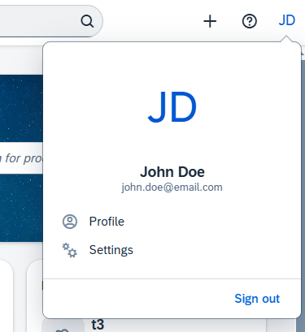
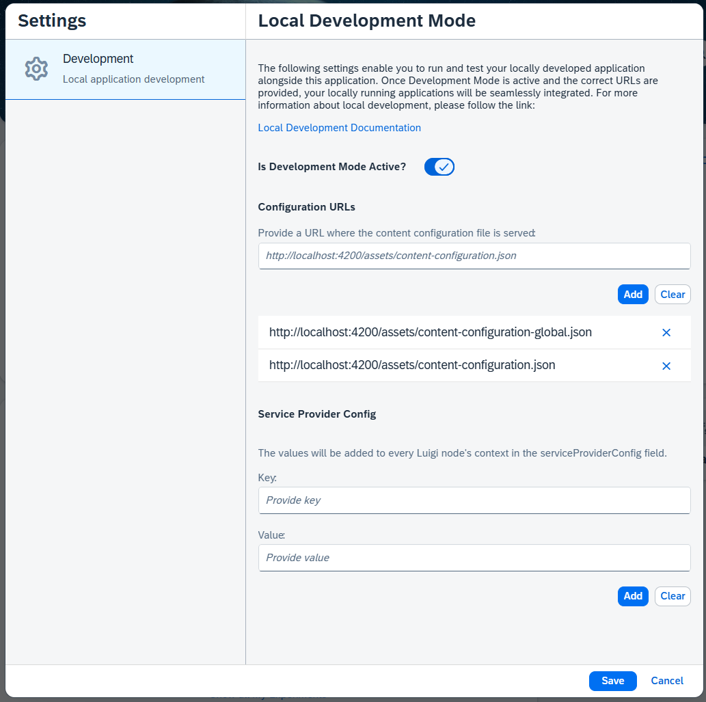

# Local extension development

A development instance of the portal provides the capability to serve local frontend applications.


## Consuming Local Content Configuration
 
In order to use your local `content-configuration.json` file on other environments (like production), you have to go to the located in the 
 `Setting -> Development` form. 



Once in the `Local Development Mode` you can turn on and customise local development settings.



### Development Mode Active

If the `Development Mode Active` is turned on and the configuration saved, the development instance of the portal will look for a 
`content-configuration.json` files on provided URLs (more precisely for example the URL `http://localhost:4200/assets/content-configuration.json` is requested).
The contents of this file are described in great detail at [nodes configuration and content-configuration](readme-nodes-configuration.md) document.

### Configuration URLs

If the URL `http://localhost:4200/assets/content-configuration.json` returns a valid `content-configuration.json`, 
the nodes defined in the `content-configuration.json` will be added into the application or overwrite any already existing nodes.
Nodes will be overwritten when the `entityType` and the `pathSegment` match an already present node.
You can provide as many `content-configuration.json` as needed:
* Provide it adding more `Configuration URLs`. The URL must be accessible from the portal domain, and it must serve a valid content configuration

### Service Provider Config

The values in `Service Provider Config` field will be added to every Luigi node's context in the `serviceProviderConfig` field,
below the example ot the outcome of setting this field on a Luigi node:

```json
{
    "label": "Overview",
    "entityType": "global.topnav",
    "viewUrl": "/overview",
    "pathSegment": "overview",
    "context": {
      "serviceProviderConfig": {
        "key1": "value1",
        "key2": "value2"
      }
      // ... other luigi node context properties
    } 
    // ... other luigi node properties
}

```

After setting the values and hitting the `Save` button the page will reload and the provided configurations will be read.

### Defining and Providing your Content Configuration

To display your frontend in the OpenMFP Portal development landscape make that in your local `content-configuration.json` 
you have specified on the node `entityType`:

- `global` to be displayed in the global navigation
- `project` to be displayed in the left-side navigation inside a project

If you do not specify a `urlTemplateParams.url` inside the `content-configuration.json`, the frontend will be loaded from localhost
where the configuration file is server (so in the example `http://localhost:4200`).
Your application will retrieve a valid token, and you can test your integration with other frontends hosted on the same portal.

With Angular, you need to:

1. Add a `content-configuration.json` file to your `assets` folder
2. Run the server locally and make it serve on the `localhost:4200` port
3. Go to the portal development instance
4. Visit the sites where you frontend is usually shown (now the local running variant is shown)

## Troubleshooting

### My node is not shown

* Did you make sure that the entity in the navigation node is set correctly? 
